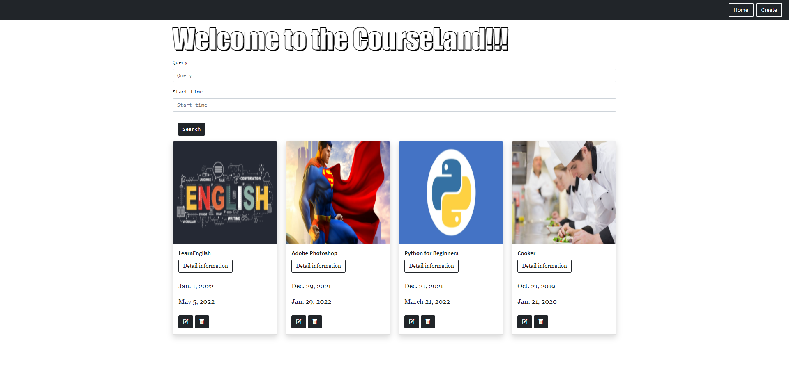
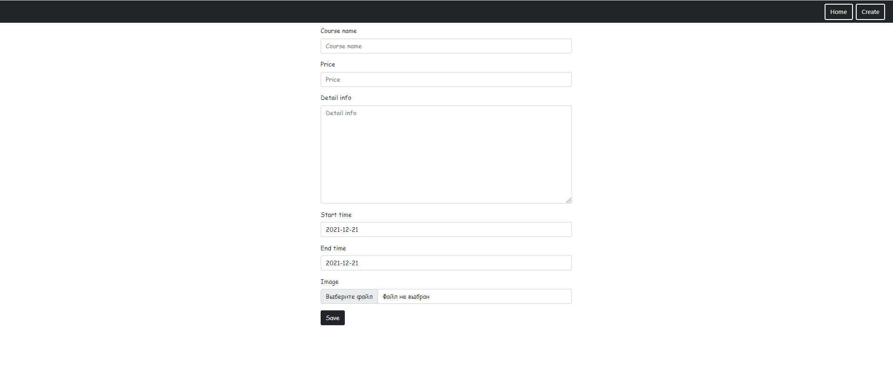

# Course catalog

Website for storing different courses. Website allows to you create your course, delete it and update it.
Courses in homepage can be found in search form by query(course name and detail information) or by start_time.

## For setting all requirements follow next command:
> pip install -r requirements.txt

> python manage.py migrate

All data stored in **SQLite**.

**_Homepage_**

**_create course form_**

**_detail information_**
